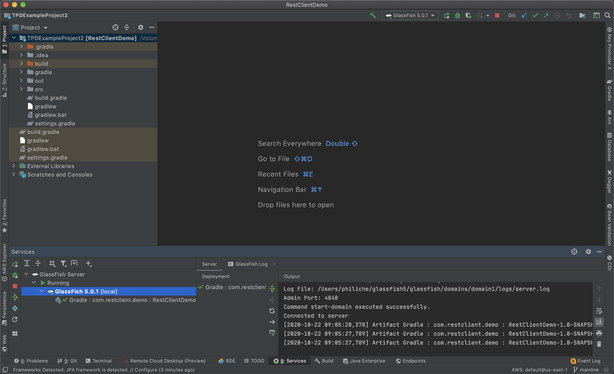

# Introduction
I created this project for a team workshop (8 engineers) on October 27, 2020. Its purpose was to help our team learn development outside of the internal tooling and ecosystem. 

In this project, we build a Glassfish web server running locally on IntelliJ and implement REST APIs for /tweets and /users. We use Postman to verify that changes are made correctly and learned about patterns like DAO, Repository, and Filter.

# Setup
## Postman 
Download Postman: https://www.postman.com/downloads/  
Postman Collection URL: https://www.getpostman.com/collections/ff8bc66a38693b02dc71

## Code Repo
Download IntelliJ Ultimate: https://www.jetbrains.com/idea/  
Open IntelliJ, clone this git repository by going to File > New > Project form Version Control. Paste in the repository clone URL.

## Glassfish
Download Glassfish: download.oracle.com/glassfish/5.0.1/release/glassfish-5.0.1-web.zip (http://download.oracle.com/glassfish/5.0.1/release/glassfish-5.0.1-web.zip)  
Open your terminal and unpack the zip in your root directory.
```zsh
cd ~/Downloads
unzip glassfish-5.0.1-web.zip
mv glassfish5 ~
```
On your IntelliJ, configure the application server following these instructions: https://www.jetbrains.com/help/idea/creating-and-running-your-first-restful-web-service.html#app-server

**Make sure you set the AS_JAVA absolute path in the glassfish5 folder's asenv.conf!**

Now you should be able to run a local server by clicking the bottom tab bar of IntelliJ > Services > Glassfish > Run. You can try opening a web page with the local port or hitting the server using Postman. The URL should be something like this: http://localhost:8080/RestClientDemo-1.0-SNAPSHOT/tweets



# Usage
## Tasks
There are several tasks contained in the source code. Clone the git repository and complete the tasks - search for "Task" in the project files.

## Testing
Start the Glassfish server to test your changes. This will bring up a local server at http://localhost:8080/.   
You will be using Postman to execute HTTP requests against the local server to verify everything works.
